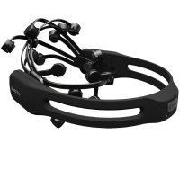
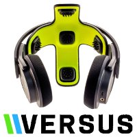

#OpenBCI

neuromore Studio currently only supports the 8/32-bit OpenBCI with 8-channels (without Daisy module).

Please follow the official [OpenBCI on Windows](http://docs.openbci.com/tutorials/10-OpenBCI_on_Windows) and [Fixing FTDI for OSX](http://docs.openbci.com/tutorials/09-Mac_FTDI_Driver_Fix) before using it with neuromore Studio.

neuromore Studio will automatically detect the OpenBCI and show it in the interface.

Supported Platforms: Windows, OSX

#InteraXon Muse

First, please pair your Muse to your PC or Mac.

Press 'Tools'->'Start Muse IO' in neuromore Studio before connecting a Muse. This will open up a little data acquisition tool that forwards data from a Muse to neuromore Studio.

Supported Platforms: Windows, OSX

##OSX

Please note that a special Muse IO version is required to run it with OSX. There was a bug in Muse-IO when connecting multiple Muses that InteraXon fixed for us (thanks so much for that Tom! :)). Please download the fix version from: [Click Here](https://neuromore-update-studio.s3.amazonaws.com/MuseIO_OSCFix_3_7_0_OSX.zip">)

Make sure to first install the official Muse SDK for OSX as the fixed Muse IO application will only work with that installed. Extract the zip file to a new folder. Now, when going to Press 'Tools'->'Start Muse IO', choose the Muse IO application from the new folder where you extracted the fix.

#Emotiv EPOC

Plug in your dongle and turn on the EPOC either before you start or while neuromore Studio is running.

Supported Platforms: Windows only

#Emotiv Insight

Plug in your dongle and turn on your Insight. Feel free to open neuromore Studio before plugging in the dongle or turning on the Insight. It will work both ways.

Supported Platforms: Windows only

#SenseLabs Versus

We do not support the consumer Bluetooth LE version of the Versus. neuromore Studio only supports the standard Bluetooth version which is sold separately. Please contact SenseLabs for further information on how to buy the research edition of the Versus.

Supported Platforms: Windows only

#Advanced Brain Monitoring X4, X10 and X24

Currently in development.

Supported Platforms: Windows only

#Mitsar EEG 201-21, 202-24 and 202-31

Currently in development.

Supported Platforms: Windows only

#Bluetooth Smart Heart Rate Sensors

The OSX version of neuromore Studio supports all kinds of Bluetooth LE heart rate sensors. Just power on your Bluetooth LE heart rate sensor and neuromore Studio will automatically detect it. This can sometimes take up to a minute. In case it doesn't find heart rate sensor, try turning it off and on again.

- [Polar H7](http://www.polar.com/en/products/accessories/H7_heart_rate_sensor)
- [Zephyr HxM Smart](http://www.zephyranywhere.com/products/hxm-smart-heart-rate-monitor)

Supported Platforms: OSX only