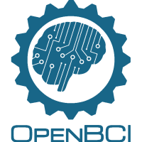
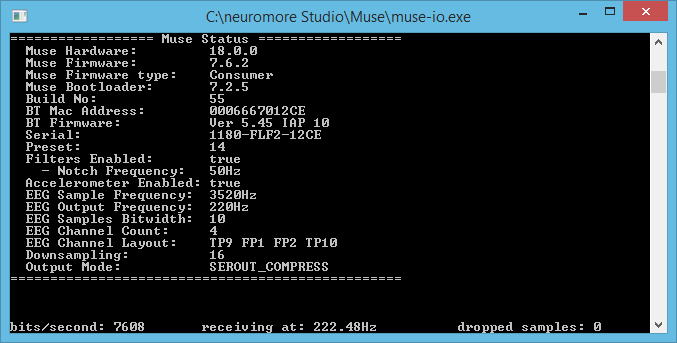
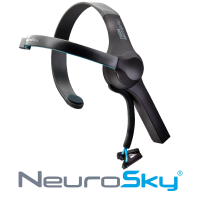
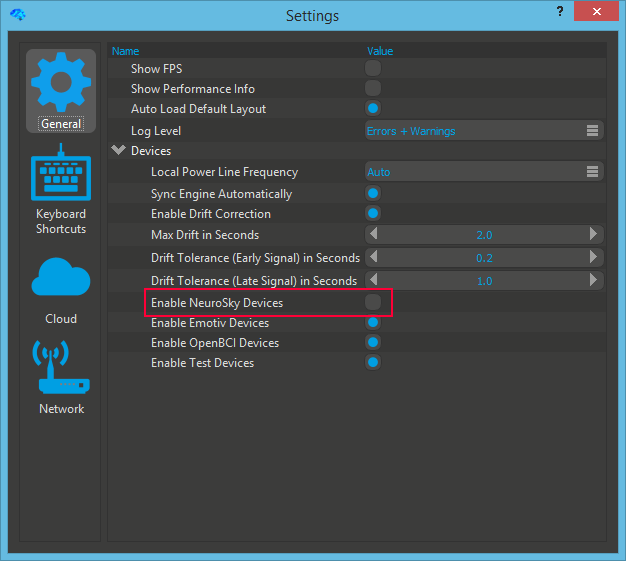
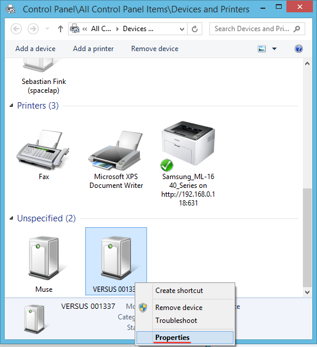
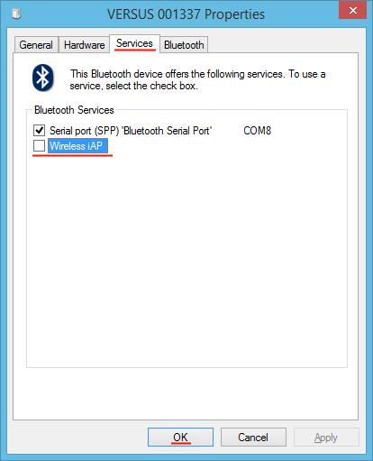

#OpenBCI

- Platforms: Windows, OSX
- Devices: OpenBCI 8/32-bit 8 channels (without Daisy module)

Please follow the official [OpenBCI on Windows](http://docs.openbci.com/tutorials/10-OpenBCI_on_Windows) and [Fixing FTDI for OSX](https://docs.openbci.com/Troubleshooting/FTDI_Fix_Mac/) before using it with neuromore Studio. The device will be automatically detected and added to the interface after it was set up correctly.

Note: Support for the Daisy module and the new Ganglion board will be added soon.

#InteraXon Muse

- Platforms: Windows, OSX
- Devices: Standard Muse (model MU-01) with the default preset

##Using a Muse on Windows

Connecting a Muse to the Studio is easy:

1.  Make sure your Muse is paired to your PC, is turned on and in reach of the receiver
2.  Press 'Tools'->'Start Muse IO' in neuromore Studio menu to start the data aquisition program
3.  The Muse will automatically appear in neuromore Studio once the connection is established

Please note that neuromore Studio doesn't work with the official Muse IO software because it outputs the data to the wrong OSC addresses. Instead we ship it with a fixed version that was provided to us by InteraXon (thanks Tom!). You can find the executable in the folder _Muse_ inside the installation directory.

##Using a Muse on OSX

A few steps are necessary to get the Muse to work on OSX:

1.  Make sure to first install the official Muse Research Tools for OSX [from here](http://developer.choosemuse.com/research-tools)
2.  Download the fixed Muse IO application [from here](https://neuromore-update-studio.s3.amazonaws.com/MuseIO_OSCFix_3_7_0_OSX.zip)
3.  Extract the application to a folder (for example your home folder)
4.  Make sure your Muse is paired to your Mac, switched on and in reach of the receiver
5.  Press 'Tools'->'Start Muse IO' in the neuromore Studio menu and choose the Muse IO application from the folder where you extracted it
6.  The data aquisition window will pop up. Keep it running while you stream data and check it for any connection errors that might appear
7.  The Muse will automatically appear in neuromore Studio once the connection is established

#NeuroSky

- Platforms: Windows
- Devices: MindWave (model MW003)

1.  If you have never connected a MindWave before you must first enable the driver in the settings once (see image).
2.  Make sure your device is paired to your PC, is turned on and in reach of the receiver
3.  The MindWave will automatically appear in neuromore Studio once the connection is established

#Emotiv EPOC / EPOC+

- Platforms: Windows
- Devices: EPOC, EPOC+

Plug in your dongle and turn on the device either before you start or while neuromore Studio is running. Connected devices will be detected automatically and shown in the interface.

#Emotiv Insight

- Devices: Insight with Emotiv Receiver Dongle

Please be aware that the Emotiv Insight has [known issues](https://emotiv.zendesk.com/hc/en-us/articles/204819169-Bluetooth-Connectivity-Issues) regarding Bluetooth LE connectivity and might not work correctly even if the operating system and USB receiver adhere to the standard. We found that the best solution is to use the [Emotiv USB Receivers](https://emotiv.com/store/product_9.html) (requires one receiver per device). This is the same receiver used by the Epoc+.

Plug in your dongle and turn on your Insight. Feel free to open neuromore Studio before plugging in the dongle or turning on the Insight. It will work both ways and the device will be automatically shown in the interface once the connection is established.

#SenseLabs Versus

- Platforms: Windows
- Devices: Versus (non-BTLE version)

Important: We do not support the consumer Bluetooth LE version of the Versus that is sold on their website right now. neuromore Studio only supports the version that comes with a standard Bluetooth interface. Please contact [SenseLabs](https://senselabs.com) for further information on how to buy this research edition of the Versus.

##Setting up the Versus

It is very important that you follow this setup procedure the first time you connect your Versus to a Windows PC. If you don't do this it will break your device and you will have to reset it (described below).

1.  Pair the Versus with your Windows PC
2.  Make sure neuromore Studio (or any other software that could access the device) is **not running**
3.  Open the _Devices and Printers_ Windows Control Panel
4.  Right click on your Versus device and select _Properties_. A window will pop up.
5.  Disable the _Wireless iAP_ service under the tab _Services_.

**Resetting the Versus**
If you started an application that accessed the Versus _before_ you disabled the iAP bluetooth service you will have to reset device:

1.  Turn off the Versus.
2.  Turn it on again but don't release the button.
3.  Keep the button pressed until the LED blinks red. The device is now reset.

#Advanced Brain Monitoring B-Alert X-Series

- Platforms: Windows
- Devices: B-Alert X4, X10 and X24

Currently in development.

#Mitsar

- Platforms: Windows
- Devices: Mitsar EEG 201-21, EEG 202-24 and EEG 202-31

Currently in development.

#Bluetooth Smart Heart Rate Sensors

- Platforms: OSX

The OSX version of neuromore Studio supports all kinds of Bluetooth LE heart rate sensors. Just power on your Bluetooth LE heart rate sensor and neuromore Studio will automatically detect it. This can sometimes take up to a minute. In case it doesn't find heart rate sensor, try turning it off and on again.

- [Polar H7](http://www.polar.com/en/products/accessories/H7_heart_rate_sensor)
- [Zephyr HxM Smart](http://www.zephyranywhere.com/products/hxm-smart-heart-rate-monitor)

Note that we currently can only confirm that the Polar H7 works. Other devices should work too if they adhere to the BTLE profiles and send BPM as well as RR interval data. Please let us know if you found other devices that work or do not work.
