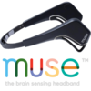
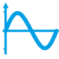
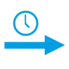
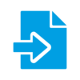
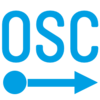
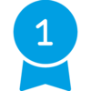
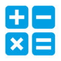
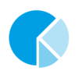
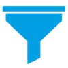

# Nodes

# Sensors Nodes 
This category contains all Input device nodes.
## Test System

| Attribute | Description |
|-----------|-------------|
| Upload | Upload the data stream to neuromore Cloud after a successful session. This is a boolean value (on/off). |
| Device ID | In case you have connected multiple devices of the same Type, use this ID to specify which one this node uses Possible values are in the range [1 .. &infin;].The default value is 1. |

## Muse

| Attribute | Description |
|-----------|-------------|
| Upload | Upload the data stream to neuromore Cloud after a successful session. This is a boolean value (on/off). |
| Device ID | In case you have connected multiple devices of the same Type, use this ID to specify which one this node uses Possible values are in the range [1 .. &infin;].The default value is 1. |

## NeuroSky

| Attribute | Description |
|-----------|-------------|
| Upload | Upload the data stream to neuromore Cloud after a successful session. This is a boolean value (on/off). |
| Device ID | In case you have connected multiple devices of the same Type, use this ID to specify which one this node uses Possible values are in the range [1 .. &infin;].The default value is 1. |

## EPOC

| Attribute | Description |
|-----------|-------------|
| Upload | Upload the data stream to neuromore Cloud after a successful session. This is a boolean value (on/off). |
| Device ID | In case you have connected multiple devices of the same Type, use this ID to specify which one this node uses Possible values are in the range [1 .. &infin;].The default value is 1. |

## OpenBCI

| Attribute | Description |
|-----------|-------------|
| Upload | Upload the data stream to neuromore Cloud after a successful session. This is a boolean value (on/off). |
| Device ID | In case you have connected multiple devices of the same Type, use this ID to specify which one this node uses Possible values are in the range [1 .. &infin;].The default value is 1. |

## Heartrate

| Attribute | Description |
|-----------|-------------|
| Upload | Upload the data stream to neuromore Cloud after a successful session. This is a boolean value (on/off). |
| Device ID | In case you have connected multiple devices of the same Type, use this ID to specify which one this node uses Possible values are in the range [1 .. &infin;].The default value is 1. |

## Accelerometer

| Attribute | Description |
|-----------|-------------|
| Upload | Upload the data stream to neuromore Cloud after a successful session. This is a boolean value (on/off). |
| Device ID | In case you have connected multiple devices of the same Type, use this ID to specify which one this node uses Possible values are in the range [1 .. &infin;].The default value is 1. |

## Gyroscope

| Attribute | Description |
|-----------|-------------|
| Upload | Upload the data stream to neuromore Cloud after a successful session. This is a boolean value (on/off). |
| Device ID | In case you have connected multiple devices of the same Type, use this ID to specify which one this node uses Possible values are in the range [1 .. &infin;].The default value is 1. |

# Input Nodes 
This category contains all Other input nodes.
## Parameter

| Attribute | Description |
|-----------|-------------|
| Value | The default static value to output. Possible values are in the range [-&infin; .. &infin;].The default value is 0.00. |
| Sample Rate | Sample rate of the output channel. Possible values are in the range [0.00 .. &infin;].The default value is 128.00. |

## Signal Generator

| Attribute | Description |
|-----------|-------------|
| Signal Type | The Type of signal to generate. Possible values are: *Sine*, *Square*, *Noise*, *Ramp*, *Sawtooth*, *Triangle*, *Brainwaves*. The default value is *Sine*. |
| Sample Rate | Sample rate of the generated signal. Possible values are in the range [0.00 .. &infin;].The default value is 128.00. |
| Frequency | Frequency of the periodic waveforms. Possible values are in the range [0.00 .. &infin;].The default value is 1.00. |
| Amplitude | Amplitude of the waveform (half of peak-to-peak). Possible values are in the range [0.00 .. &infin;].The default value is 1.00. |
| DC-Offset | DC-Offset of the signal. Possible values are in the range [-&infin; .. &infin;].The default value is 0.00. |

## OSC Input

| Attribute | Description |
|-----------|-------------|
| OSC address | The OSC address that is listened to. The node will always output the last received float value. |
| Sample rate | Sample rate of the incoming data. Possible values are in the range [0.00 .. &infin;].The default value is 128.00. |

## Session Time

| Attribute | Description |
|-----------|-------------|
| Time Unit | The time unit to convert the session time to. Possible values are: *Milliseconds*, *Seconds*, *Minutes*, *Hours*. The default value is *Seconds*. |
| Sample Rate | Sample rate of the generated signal. Possible values are in the range [1.00 .. &infin;].The default value is 128.00. |

## Cloud Input

| Attribute | Description |
|-----------|-------------|
| Default Value | Default value used in case this parameter does not exist on the server. Possible values are in the range [-&infin; .. &infin;].The default value is 0.00. |
| Sample Rate | Sample rate of the output channel. Possible values are in the range [0.00 .. &infin;].The default value is 128.00. |
| Type | Parameter type. Possible values are: *User Parameter*, *Classifier Parameter*. The default value is *User Parameter*. |
| Request Mode | The type of request sent to the server. Possible values are: *Current Value*, *Previous Values*, *All Values*, *Time Range*. The default value is *Current Value*. |

## File Reader

| Attribute | Description |
|-----------|-------------|
| File | The local filename of the data file. |
| Format | The data format of the input file. Possible values are: *Simple CSV 	(*.csv)*, *Timestamped CSV 	(*.csv)*. The default value is *Simple CSV 	(*.csv)*. |
| Sample Rate | Override the sample rate of the output channels. Possible values are in the range [0.00 .. &infin;].The default value is 0.00. |

# Output Nodes 
This category contains all Output Nodes.
## Custom Feedback

| Attribute | Description |
|-----------|-------------|
| Resolution | Select the signal resolution. This affects the size of the stored or uploaded data and the feedback latency. Possible values are: *Original*, *High*, *Mid*, *Low*. The default value is *High*. |
| Upload | Upload the data stream to neuromore Cloud after a successful session. This is a boolean value (on/off). |
| Send OSC Msgs | Send the values via OSC to all connected network clients. This is a boolean value (on/off). |
| OSC Address | OSC address, e.g. /feedback/1. |
| User ID | In case multiple people are connected simultaneously, use this ID to identify the user. Possible values are in the range [0 .. &infin;].The default value is 0. |
| Is Ranged | Set to true in case the value range of the feedback is known upfront. Input value can be any value in case of false. This is a boolean value (on/off). |
| Range Min | Minimum possible feedback value. Values smaller than this will be clamped Possible values are in the range [-&infin; .. &infin;].The default value is 0.00. |
| Range Max | Maximum possible feedback value. Values bigger than this will be clamped Possible values are in the range [-&infin; .. &infin;].The default value is 1.00. |

## Body Feedback

| Attribute | Description |
|-----------|-------------|
| Resolution | Select the signal resolution. This affects the size of the stored or uploaded data and the feedback latency. Possible values are: *Original*, *High*, *Mid*, *Low*. The default value is *High*. |
| Upload | Upload the data stream to neuromore Cloud after a successful session. This is a boolean value (on/off). |
| Send OSC Msgs | Send the values via OSC to all connected network clients. This is a boolean value (on/off). |
| User ID | In case multiple people are connected simultaneously, use this ID to identify the user. Possible values are in the range [0 .. &infin;].The default value is 0. |

## OSC Output

| Attribute | Description |
|-----------|-------------|
| Resolution | Select the signal resolution. This affects the size of the stored or uploaded data and the feedback latency. Possible values are: *Original*, *High*, *Mid*, *Low*. The default value is *High*. |
| Upload | Upload the data stream to neuromore Cloud after a successful session. This is a boolean value (on/off). |
| OSC Address | e.g. /out/1. |

## Points

| Attribute | Description |
|-----------|-------------|
| Points Multiplier | . Possible values are in the range [0 .. 10000].The default value is 10. |

## Cloud Output

| Attribute | Description |
|-----------|-------------|
| Type | Parameter type. Possible values are: *User Parameter*, *Classifier Parameter*. The default value is *User Parameter*. |
| Save Mode | Keep parmeter history or overwrite the parameter. Possible values are: *Overwrite Value*, *Save History*. The default value is *Overwrite Value*. |

## File Writer

| Attribute | Description |
|-----------|-------------|
| File | The local filename of the output file. |
| Format | The file format of the output file. Possible values are: *Simple CSV 	(*.csv)*, *Timestamped CSV 	(*.csv)*. The default value is *Simple CSV 	(*.csv)*. |
| Write Mode | Changes the write behaviour. Possible values are: *Never Overwrite*, *Always Overwrite*, *Overwrite during Session*, *Append*. The default value is *Never Overwrite*. |

# Math Nodes 
This category contains all Simple mathematical node.
## Function

This node has no attributes.

## Operation

| Attribute | Description |
|-----------|-------------|
| Math Function | The math function to use. Possible values are: *Add*, *Subtract*, *Multiply*, *Divide*, *Average*, *Random Float*, *Mod*, *Minimum*, *Maximum*, *Power*. The default value is *Add*. |
| Static Value | Value used for x or y when the input port has no connection. Possible values are in the range [-&infin; .. &infin;].The default value is 1.00. |

## Compare

| Attribute | Description |
|-----------|-------------|
| Function | The copmarator function to use. Possible values are: *Equal to 	(x == y)*, *Greater than 	(x > y)*, *Less than 	(x < y)*, *Grt. or Equal 	(x >= y)*, *Less or Equal 	(x <= y)*, *Inequal to 	(x != y)*. The default value is *Equal to 	(x == y)*. |
| Static Value | Value used for x or y when the input port has no connection. Possible values are in the range [-&infin; .. &infin;].The default value is 0.00. |
| True Return Mode | What to return when the result is true. Possible values are: *Return True Value*, *Return X*, *Return Y*. The default value is *Return True Value*. |
| Result when True | The value returned when the expression is true. Possible values are in the range [-&infin; .. &infin;].The default value is 1.00. |
| False Return Mode | What to return when the result is false. Possible values are: *Return False Value*, *Return X*, *Return Y*. The default value is *Return False Value*. |
| Result when False | The value returned when the expression is false. Possible values are in the range [-&infin; .. &infin;].The default value is 0.00. |

## Logic

| Attribute | Description |
|-----------|-------------|
| Logic Function | The logic function to use. Possible values are: *AND*, *OR*, *XOR*. The default value is *AND*. |
| Static Value | Value used for x or y when the input port has no connection. Possible values are: *False*, *True*. The default value is *False*. |
| Float Result when True | The float value returned when the expression is true. Possible values are in the range [-&infin; .. &infin;].The default value is 1.00. |
| Float Result when False | The float value returned when the expression is false. Possible values are in the range [-&infin; .. &infin;].The default value is 0.00. |

## Remap

| Attribute | Description |
|-----------|-------------|
| Input Min | The minimum incoming value. Values smaller than this will be clipped. Possible values are in the range [-&infin; .. &infin;].The default value is 0.00. |
| Input Max | The maximum incoming value. Values bigger than this will be clipped. Possible values are in the range [-&infin; .. &infin;].The default value is 1.00. |
| Output Min | The minimum outcoming value. The minimum incoming value will be mapped to the minimum outcoming value. The output port can't hold a smaller value than this. Possible values are in the range [-&infin; .. &infin;].The default value is 0.00. |
| Output Max | The maximum outcoming value. The maximum incoming value will be mapped to the maximum outcoming value. The output port can't hold a bigger value than this. Possible values are in the range [-&infin; .. &infin;].The default value is 1.00. |

## Channel Math

| Attribute | Description |
|-----------|-------------|
| Math Function | The math function to use. Possible values are: *Sum*, *Product*, *Average*, *Minimum*, *Maximum*, *Harmonic Mean*, *Geometric Mean*, *Root Mean Square*, *Sum of Squares*. The default value is *Sum*. |

## Statistics

| Attribute | Description |
|-----------|-------------|
| Interval Length | The length of the interval used for calculating the statistics, in seconds. Possible values are in the range [0.01 .. &infin;].The default value is 1.00. |
| Statistic | The statistic over the interval. Possible values are: *Minimum*, *Maximum*, *Range*, *Mean*, *Median*, *Variance*, *Standard Deviation*, *RMS*, *Percentile*, *Sum of Elements*, *Product of Elements*, *Harmonic Mean*, *Geometric Mean*. The default value is *Mean*. |
| Epoching | If epoching is on, the statistic are taken of consecutive epochs instead of every sample. Disable this if you want fast feedback. Possible values are: *On*, *Off*. The default value is *Off*. |

## Threshold

| Attribute | Description |
|-----------|-------------|
| Interval Length | The length of the interval that will be looked at. Set to 0 to use an infinite interval. Possible values are in the range [0.00 .. 30.00].The default value is 1.00. |
| Use Range | If enabled a threshold range will be used instead of a single threshold value. This is a boolean value (on/off). |
| Low Threshold | The threshold value and lower value of the threshold range that is used if the input port is not connected. Possible values are in the range [-&infin; .. &infin;].The default value is 0.50. |
| Compare Function | The comparator function to use. Possible values are: *Equal to 	(x == T)*, *Greater than 	(x > T)*, *Less than 	(x < T)*, *Grt. or Equal 	(x >= T)*, *Less or Equal 	(x <= T)*, *Inequal to 	(x != T)*. The default value is *Greater than 	(x > T)*. |

# DSP Nodes 
This category contains all Advanced digital signal processing nodes.
## FFT

| Attribute | Description |
|-----------|-------------|
| FFT Order | Order of the FFT. Possible values are in the range [2 .. 20].The default value is 7. |
| Window Function | The Time-Domain Window Function that is applied to the input of the FFT. Possible values are: *Rectangular*, *Triangular*, *Welch*, *Hann*, *Hamming*, *Blackman*, *Nuttall*, *Blackman-Nuttall*, *Blackman-Harris*, *Flat top*, *Cosine*, *Gaussian*, *Bartlett-Hann*, *Hann-Poisson*, *Lanczos*. The default value is *Hann*. |
| Window Shift | The number of samples the FFT input window advances in each iteration. Possible values are in the range [1 .. 1024].The default value is 1. |

## IIR/FIR Filter

| Attribute | Description |
|-----------|-------------|
| Filter Type | The Type of the filter. Possible values are: *Lowpass*, *Highpass*, *Bandpass*, *Bandstop*. The default value is *Lowpass*. |
| Filter Method | The Method that should be used to construct the filter. Possible values are: *Bessel*, *Butterworth*, *Chebyshev I*, *Chebyshev II*, *Elliptic*, *Hann*, *Hamming*, *Blackman*, *Sinc*. The default value is *Butterworth*. |
| Filter Order | The Order of the Filter. Possible values are in the range [1 .. 10].The default value is 3. |
| Low Cut Frequency | The corner frequency of the lowpass / lower cut frequency of bandpass/bandstop Possible values are in the range [0.00 .. 100.00].The default value is 7.00. |

## Frequency Band

| Attribute | Description |
|-----------|-------------|
| Preset | Brainwave Frequencyband presets. Possible values are: *Delta*, *Theta*, *Alpha*, *SMR*, *Beta*, *Gamma*, *Custom*. The default value is *Delta*. |
| Lower Frequency | The lower bound of the frequency range. Possible values are in the range [0.00 .. 200.00].The default value is 0.50. |
| Upper Frequency | The upper bound of the frequency range. Possible values are in the range [0.00 .. 200.00].The default value is 3.90. |

## Dominant Frequency

| Attribute | Description |
|-----------|-------------|
| Preset | Brainwave Frequencyband presets. Possible values are: *Delta*, *Theta*, *Alpha*, *SMR*, *Beta*, *Gamma*, *Custom*. The default value is *Delta*. |
| Lower Frequency | The lower bound of the frequency range. Possible values are in the range [0.00 .. 200.00].The default value is 0.50. |
| Upper Frequency | The upper bound of the frequency range. Possible values are in the range [0.00 .. 200.00].The default value is 3.90. |

## Biquad Filter

| Attribute | Description |
|-----------|-------------|
| B0 | Biquad Coefficient B 0 |
| B1 | Biquad Coefficient B 1 |
| B2 | Biquad Coefficient B 2 |
| A1 | Biquad Coefficient A 1 |
| A2 | Biquad Coefficient A 2 |
| Gain | Biquad Filter Gain |

## Select Bins

| Attribute | Description |
|-----------|-------------|
| Use Multichannel | Bundle the selected spectrum bins in a multichannel instead of using one port per bin. This is a boolean value (on/off). |
| Lower Frequency | The lower bound of the frequency range. Possible values are in the range [0.00 .. 200.00].The default value is 0.00. |
| Upper Frequency | The upper bound of the frequency range. Possible values are in the range [0.00 .. 200.00].The default value is 128.00. |
| Lock Ports |  This is a boolean value (on/off). |

# Bio Nodes 
This category contains all Nodes for bio feedback and bio signal analysis.
## HRV Analysis

| Attribute | Description |
|-----------|-------------|
| Method | The calculated HRV metric. Possible values are: *RMSSD*, *SDSD*, *EBC*, *pRR50*, *pRR20*. The default value is *RMSSD*. |
| Number of RR Intervals | How many RR intervals are used in the analysis. Possible values are in the range [2 .. &infin;].The default value is 10. |

# Utils Nodes 
This category contains all Utilitys and nodes for channel management.
## Smoothing

| Attribute | Description |
|-----------|-------------|
| Interpolation Speed | The interpolation speed where 0.0 means the value won't change at all and 1.0 means the input value will directly be mapped to the output value. Possible values are in the range [0.00 .. 1.00].The default value is 0.75. |
| Start Value | Start value for interpolation. Possible values are in the range [-&infin; .. &infin;].The default value is 0.00. |

## Delay

| Attribute | Description |
|-----------|-------------|
| Set by Time | If true the delay stays the same if the sample rate changes. This is a boolean value (on/off). |
| Delay in Samples | The number of samples the signal is delayed. Possible values are in the range [0 .. &infin;].The default value is 0. |
| Delay in Seconds | The time the signal should be delayed. Note: The resolution is limited by the sample rate of the signal. Possible values are in the range [0.00 .. &infin;].The default value is 0.00. |

## Resample

| Attribute | Description |
|-----------|-------------|
| Sample Rate | The target sample rate. Possible values are in the range [0.00 .. &infin;].The default value is 128.00. |
| Mode | Select Realtime for applications where a zero delay is most important. Use 'Best Quality' if the signal's frequency spectrum is more important. Possible values are: *Realtime*, *Good Quality*. The default value is *Realtime*. |

## Freeze

| Attribute | Description |
|-----------|-------------|
| Time in Seconds | Freeze (Hold) the input value after this many seconds. Possible values are in the range [0.00 .. &infin;].The default value is 0.00. |
| Pass Through | If enabled, the input is forwarded until the freeze is triggered. This is a boolean value (on/off). |

## Merge Channels

This node has no attributes.

## Select Channels

| Attribute | Description |
|-----------|-------------|
| Lock Ports |  This is a boolean value (on/off). |

## View

| Attribute | Description |
|-----------|-------------|
| Scaling | How the waveform should be scaled in the view. Possible values are: *Auto (Peak)*, *Auto (Peak RMS)*, *Custom Range*. The default value is *Auto (Peak)*. |
| Custom Color | Use a user defined color for signal display. This is a boolean value (on/off). |

## Rename

This node has no attributes.

