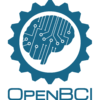
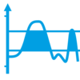
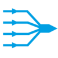

# Sensors Nodes 

This category contains all nodes for accessing bio sensors. Every device has a corresponding node that outputs all available data streams to the classifier.

## Test System

Outputs simulated brainwaves generated by the Test Device. The test device is always connected if no other device is found.

[//]: # ()

## Muse

[//]: # ()

[//]: # (Muse:Attributes:Begin)
| Attribute | Description |
|-----------|-------------|
| Upload | Upload the data stream to neuromore Cloud after a successful session. This is a boolean value (on/off). |
| Device ID | In case you have connected multiple devices of the same Type, use this ID to specify which one this node uses. Possible values are in the range [1 .. &infin;]. The default value is 1. |
[//]: # (Muse:Attributes:End)

## NeuroSky

[//]: # ()

[//]: # (NeuroSky:Attributes:Begin)
| Attribute | Description |
|-----------|-------------|
| Upload | Upload the data stream to neuromore Cloud after a successful session. This is a boolean value (on/off). |
| Device ID | In case you have connected multiple devices of the same Type, use this ID to specify which one this node uses. Possible values are in the range [1 .. &infin;]. The default value is 1. |
[//]: # (NeuroSky:Attributes:End)

## EPOC

[//]: # ()

[//]: # (EPOC:Attributes:Begin)
| Attribute | Description |
|-----------|-------------|
| Upload | Upload the data stream to neuromore Cloud after a successful session. This is a boolean value (on/off). |
| Device ID | In case you have connected multiple devices of the same Type, use this ID to specify which one this node uses. Possible values are in the range [1 .. &infin;]. The default value is 1. |
[//]: # (EPOC:Attributes:End)

## Insight

[//]: # ()

[//]: # (Insight:Attributes:Begin)
| Attribute | Description |
|-----------|-------------|
| Upload | Upload the data stream to neuromore Cloud after a successful session. This is a boolean value (on/off). |
| Device ID | In case you have connected multiple devices of the same Type, use this ID to specify which one this node uses. Possible values are in the range [1 .. &infin;]. The default value is 1. |
[//]: # (Insight:Attributes:End)

## OpenBCI

[//]: # ()

[//]: # (OpenBCI:Attributes:Begin)
| Attribute | Description |
|-----------|-------------|
| Upload | Upload the data stream to neuromore Cloud after a successful session. This is a boolean value (on/off). |
| Device ID | In case you have connected multiple devices of the same Type, use this ID to specify which one this node uses. Possible values are in the range [1 .. &infin;]. The default value is 1. |
[//]: # (OpenBCI:Attributes:End)

## Heartrate

[//]: # ()

[//]: # (Heartrate:Attributes:Begin)
| Attribute | Description |
|-----------|-------------|
| Upload | Upload the data stream to neuromore Cloud after a successful session. This is a boolean value (on/off). |
| Device ID | In case you have connected multiple devices of the same Type, use this ID to specify which one this node uses. Possible values are in the range [1 .. &infin;]. The default value is 1. |
[//]: # (Heartrate:Attributes:End)

[//]: # ( COMMENT BLOCK
## Accelerometer

[//]: # ()

[//]: # (Accelerometer:Attributes:Begin)
| Attribute | Description |
|-----------|-------------|
| Upload | Upload the data stream to neuromore Cloud after a successful session. This is a boolean value (on/off). |
| Device ID | In case you have connected multiple devices of the same Type, use this ID to specify which one this node uses. Possible values are in the range [1 .. &infin;]. The default value is 1. |
[//]: # (Accelerometer:Attributes:End)

## Gyroscope

[//]: # ()

[//]: # (Gyroscope:Attributes:Begin)
| Attribute | Description |
|-----------|-------------|
| Upload | Upload the data stream to neuromore Cloud after a successful session. This is a boolean value (on/off). |
| Device ID | In case you have connected multiple devices of the same Type, use this ID to specify which one this node uses. Possible values are in the range [1 .. &infin;]. The default value is 1. |
[//]: # (Gyroscope:Attributes:End)

END COMMENT BLOCK)

# Input Nodes 

This category contains all input nodes that either generate their own data or aquire it from somewhere else like the file system or a webservice.

## Parameter

The parameter node outputs a constant value that can be set by the user.

[//]: # (Parameter:Attributes:Begin)
| Attribute | Description |
|-----------|-------------|
| Value | The default static value to output. Possible values are in the range [-&infin; .. &infin;]. The default value is 0.00. |
| Sample Rate | Sample rate of the output channel. Possible values are in the range [0.00 .. &infin;]. The default value is 128.00. |
[//]: # (Parameter:Attributes:End)

## Signal Generator

This node can generate different kinds of periodic waveforms, noise and simulated brain waves.

[//]: # (Signal Generator:Attributes:Begin)
| Attribute | Description |
|-----------|-------------|
| Signal Type | The Type of signal to generate. Possible values are: *Sine*, *Square*, *Noise*, *Ramp*, *Sawtooth*, *Triangle*, *Brainwaves*. The default value is *Sine*. |
| Sample Rate | Sample rate of the generated signal. Possible values are in the range [0.00 .. &infin;]. The default value is 128.00. |
| Frequency | Frequency of the periodic waveforms. Possible values are in the range [0.00 .. &infin;]. The default value is 1.00. |
| Amplitude | Amplitude of the waveform (half of peak-to-peak). Possible values are in the range [0.00 .. &infin;]. The default value is 1.00. |
| DC-Offset | DC-Offset of the signal. Possible values are in the range [-&infin; .. &infin;]. The default value is 0.00. |
[//]: # (Signal Generator:Attributes:End)

## OSC Input

Receives float values from network clients or local clients via OSC. By default the Studio listens to UDP port 4545 but this can be changed in the settings.

[//]: # (OSC Input:Attributes:Begin)
| Attribute | Description |
|-----------|-------------|
| OSC address | The OSC address that is listened to. The node will always output the last received float value. |
| Sample rate | Sample rate of the incoming data. Possible values are in the range [0.00 .. &infin;]. The default value is 128.00. |
[//]: # (OSC Input:Attributes:End)

## Session Time

Outputs the elapsed session time (time since the last reset of the classifier). The time can be output in different formats.

[//]: # (Session Time:Attributes:Begin)
| Attribute | Description |
|-----------|-------------|
| Time Unit | The time unit to convert the session time to. Possible values are: *Milliseconds*, *Seconds*, *Minutes*, *Hours*. The default value is *Seconds*. |
| Sample Rate | Sample rate of the generated signal. Possible values are in the range [1.00 .. &infin;]. The default value is 128.00. |
[//]: # (Session Time:Attributes:End)

## Cloud Input

The Cloud Input node can be used to retreive parameters that are stored in the neuromore Cloud. The value will be requested during a session start and doesn't change while it is running. To store parameters in the Cloud, use the Cloud Output node.

[//]: # (Cloud Input:Attributes:Begin)
| Attribute | Description |
|-----------|-------------|
| Default Value | Default value used in case this parameter does not exist on the server. Possible values are in the range [-&infin; .. &infin;]. The default value is 0.00. |
| Sample Rate | Sample rate of the output channel. Possible values are in the range [0.00 .. &infin;]. The default value is 128.00. |
| Type | Parameter type. Possible values are: *User Parameter*, *Classifier Parameter*. The default value is *User Parameter*. |
| Request Mode | The type of request sent to the server. Possible values are: *Current Value*, *Previous Values*, *All Values*, *Time Range*. The default value is *Current Value*. |
[//]: # (Cloud Input:Attributes:End)

## File Reader

Reads simple multi channel CSV files from the filesystem and outputs the values in a loop.

[//]: # (File Reader:Attributes:Begin)
| Attribute | Description |
|-----------|-------------|
| File | The local filename of the data file. |
| Format | The data format of the input file. Possible values are: *Simple CSV 	(*.csv)*, *Timestamped CSV 	(*.csv)*. The default value is *Simple CSV 	(*.csv)*. |
| Sample Rate | Override the sample rate of the output channels. Possible values are in the range [0.00 .. &infin;]. The default value is 0.00. |
[//]: # (File Reader:Attributes:End)

# Output Nodes 

This category contains all node that transport data out of the classifier, for example for viewing or storage.

## Custom Feedback

The default node to output classifier results. This node is used to stream a single data channel to neuromore Visualizations and to the Cloud report generation.
Feedback values are also by default continously displayed in the Feedback History Plugin. It is recommended to use this node for the main classifier outputs like the calculated metrics or the user feedback path.

[//]: # (Custom Feedback:Attributes:Begin)
| Attribute | Description |
|-----------|-------------|
| Resolution | Select the signal resolution. This affects the size of the stored or uploaded data and the feedback latency. Possible values are: *Original*, *High*, *Mid*, *Low*. The default value is *High*. |
| Upload | Upload the data stream to neuromore Cloud after a successful session. This is a boolean value (on/off). |
| Send OSC Msgs | Send the values via OSC to all connected network clients. This is a boolean value (on/off). |
| OSC Address | OSC address, e.g. /feedback/1. |
| User ID | In case multiple people are connected simultaneously, use this ID to identify the user. Possible values are in the range [0 .. &infin;]. The default value is 0. |
| Is Ranged | Set to true in case the value range of the feedback is known upfront. Input value can be any value in case of false. This is a boolean value (on/off). |
| Range Min | Minimum possible feedback value. Values smaller than this will be clamped Possible values are in the range [-&infin; .. &infin;]. The default value is 0.00. |
| Range Max | Maximum possible feedback value. Values bigger than this will be clamped Possible values are in the range [-&infin; .. &infin;]. The default value is 1.00. |
[//]: # (Custom Feedback:Attributes:End)

## Body Feedback

A special node used to stream heartrate and breathing rate to neuromore Visualizations. Behaves like the Custom Feedback node but has ports with a dedicated use.

[//]: # (Body Feedback:Attributes:Begin)
| Attribute | Description |
|-----------|-------------|
| Resolution | Select the signal resolution. This affects the size of the stored or uploaded data and the feedback latency. Possible values are: *Original*, *High*, *Mid*, *Low*. The default value is *High*. |
| Upload | Upload the data stream to neuromore Cloud after a successful session. This is a boolean value (on/off). |
| Send OSC Msgs | Send the values via OSC to all connected network clients. This is a boolean value (on/off). |
| User ID | In case multiple people are connected simultaneously, use this ID to identify the user. Possible values are in the range [0 .. &infin;]. The default value is 0. |
[//]: # (Body Feedback:Attributes:End)

## OSC Output

This node is used to send OSC packets back into the network. It regularly outputs a single value to a specified address. The default port is UDP 45554 and can be chagned in the settings.

[//]: # (OSC Output:Attributes:Begin)
| Attribute | Description |
|-----------|-------------|
| Resolution | Select the signal resolution. This affects the size of the stored or uploaded data and the feedback latency. Possible values are: *Original*, *High*, *Mid*, *Low*. The default value is *High*. |
| Upload | Upload the data stream to neuromore Cloud after a successful session. This is a boolean value (on/off). |
| OSC Address | e.g. /out/1. |
[//]: # (OSC Output:Attributes:End)

## Points

The Points node can be used calculate an overall session score by integrating the (scaled) input over time. The value is also sent to neuromore Visualizations.

[//]: # (Points:Attributes:Begin)
| Attribute | Description |
|-----------|-------------|
| Points Multiplier | . Possible values are in the range [0 .. 10000]. The default value is 10. |
[//]: # (Points:Attributes:End)

## Cloud Output

This node stores a single value in the neuromore Cloud and can be read back with the Cloud Input node. The value is only written after a session was completed successfully.

[//]: # (Cloud Output:Attributes:Begin)
| Attribute | Description |
|-----------|-------------|
| Type | Parameter type. Possible values are: *User Parameter*, *Classifier Parameter*. The default value is *User Parameter*. |
| Save Mode | Keep parmeter history or overwrite the parameter. Possible values are: *Overwrite Value*, *Save History*. The default value is *Overwrite Value*. |
[//]: # (Cloud Output:Attributes:End)

## File Writer

The File Writer node can write simple CSV files to the filesystem. The files can be read back with the File Reader node.

[//]: # (File Writer:Attributes:Begin)
| Attribute | Description |
|-----------|-------------|
| File | The local filename of the output file. |
| Format | The file format of the output file. Possible values are: *Simple CSV 	(*.csv)*, *Timestamped CSV 	(*.csv)*. The default value is *Simple CSV 	(*.csv)*. |
| Write Mode | Changes the write behaviour. Possible values are: *Never Overwrite*, *Always Overwrite*, *Overwrite during Session*, *Append*. The default value is *Never Overwrite*. |
[//]: # (File Writer:Attributes:End)

# Math Nodes 

This category contains common mathematical functions and methods.

## Function

Mathematical operations like `sine()` and `abs()`.

[//]: # (Function:Attributes:Begin)
| Attribute | Description |
|-----------|-------------|
| Math Function | The math function to use. Possible values are: *Sine*, *Cosine*, *Tan*, *Square*, *Square Root*, *Absolute*, *Floor*, *Ceil*, *One Over X*, *Inverse Square Root*, *Natural Log*, *Log Base 10*, *Exponent*, *Fraction*, *Sign*, *Is Positive*, *Is Negative*, *Is Near Zero*, *Random Float*, *Radians to Degrees*, *Degrees to Radians*, *Smooth Step [0..1]*, *Arc Cosine*, *Arc Sine*, *Arc Tan*. The default value is *Sine*. |
[//]: # (Function:Attributes:End)

## Operation

Mathematical operations like addition and multiplication.

[//]: # (Operation:Attributes:Begin)
| Attribute | Description |
|-----------|-------------|
| Math Function | The math function to use. Possible values are: *Add*, *Subtract*, *Multiply*, *Divide*, *Average*, *Random Float*, *Mod*, *Minimum*, *Maximum*, *Power*. The default value is *Add*. |
| Static Value | Value used for x or y when the input port has no connection. Possible values are in the range [-&infin; .. &infin;]. The default value is 1.00. |
[//]: # (Operation:Attributes:End)

## Compare

This node compares two values, either from to channels or a single channel against a static value.

[//]: # (Compare:Attributes:Begin)
| Attribute | Description |
|-----------|-------------|
| Function | The copmarator function to use. Possible values are: *Equal to 	(x == y)*, *Greater than 	(x > y)*, *Less than 	(x < y)*, *Grt. or Equal 	(x >= y)*, *Less or Equal 	(x <= y)*, *Inequal to 	(x != y)*. The default value is *Equal to 	(x == y)*. |
| Static Value | Value used for x or y when the input port has no connection. Possible values are in the range [-&infin; .. &infin;]. The default value is 0.00. |
| True Return Mode | What to return when the result is true. Possible values are: *Return True Value*, *Return X*, *Return Y*. The default value is *Return True Value*. |
| Result when True | The value returned when the expression is true. Possible values are in the range [-&infin; .. &infin;]. The default value is 1.00. |
| False Return Mode | What to return when the result is false. Possible values are: *Return False Value*, *Return X*, *Return Y*. The default value is *Return False Value*. |
| Result when False | The value returned when the expression is false. Possible values are in the range [-&infin; .. &infin;]. The default value is 0.00. |
[//]: # (Compare:Attributes:End)

## Logic

The Logic node provides boolean operations. A value of 0.0 is interpreted as `false`, every other value as `true`.

[//]: # (Logic:Attributes:Begin)
| Attribute | Description |
|-----------|-------------|
| Logic Function | The logic function to use. Possible values are: *AND*, *OR*, *XOR*. The default value is *AND*. |
| Static Value | Value used for x or y when the input port has no connection. Possible values are: *False*, *True*. The default value is *False*. |
| Float Result when True | The float value returned when the expression is true. Possible values are in the range [-&infin; .. &infin;]. The default value is 1.00. |
| Float Result when False | The float value returned when the expression is false. Possible values are in the range [-&infin; .. &infin;]. The default value is 0.00. |
[//]: # (Logic:Attributes:End)

## Remap

Map a value from one value range into another with a linear transform.

[//]: # (Remap:Attributes:Begin)
| Attribute | Description |
|-----------|-------------|
| Input Min | The minimum incoming value. Values smaller than this will be clipped. Possible values are in the range [-&infin; .. &infin;]. The default value is 0.00. |
| Input Max | The maximum incoming value. Values bigger than this will be clipped. Possible values are in the range [-&infin; .. &infin;]. The default value is 1.00. |
| Output Min | The minimum outcoming value. The minimum incoming value will be mapped to the minimum outcoming value. The output port can't hold a smaller value than this. Possible values are in the range [-&infin; .. &infin;]. The default value is 0.00. |
| Output Max | The maximum outcoming value. The maximum incoming value will be mapped to the maximum outcoming value. The output port can't hold a bigger value than this. Possible values are in the range [-&infin; .. &infin;]. The default value is 1.00. |
[//]: # (Remap:Attributes:End)

## Channel Math

Use this node to apply mathematical operations accross multiple channels, for example to calculate the average of a list of signals. This node has dynamic input ports, meaning that ports are automatically added as you connect signals.

[//]: # (Channel Math:Attributes:Begin)
| Attribute | Description |
|-----------|-------------|
| Math Function | The math function to use. Possible values are: *Sum*, *Product*, *Average*, *Minimum*, *Maximum*, *Harmonic Mean*, *Geometric Mean*, *Root Mean Square*, *Sum of Squares*. The default value is *Sum*. |
[//]: # (Channel Math:Attributes:End)

## Statistics

Common univariate statistic methods in the time domain.

[//]: # (Statistics:Attributes:Begin)
| Attribute | Description |
|-----------|-------------|
| Interval Length | The length of the interval used for calculating the statistics, in seconds. Possible values are in the range [0.01 .. &infin;]. The default value is 1.00. |
| Statistic | The statistic over the interval. Possible values are: *Minimum*, *Maximum*, *Range*, *Mean*, *Median*, *Variance*, *Standard Deviation*, *RMS*, *Percentile*, *Sum of Elements*, *Product of Elements*, *Harmonic Mean*, *Geometric Mean*. The default value is *Mean*. |
| Epoching | If epoching is on, the statistic are taken of consecutive epochs instead of every sample. Disable this if you want fast feedback. Possible values are: *On*, *Off*. The default value is *Off*. |
[//]: # (Statistics:Attributes:End)

## Threshold

The Threshold node counts the number of samples within an epoch that meet a certain condition and calculates the ratio to the number of samples that did not.

[//]: # (Threshold:Attributes:Begin)
| Attribute | Description |
|-----------|-------------|
| Interval Length | The length of the interval that will be looked at. Set to 0 to use an infinite interval. Possible values are in the range [0.00 .. 30.00]. The default value is 1.00. |
| Use Range | If enabled a threshold range will be used instead of a single threshold value. This is a boolean value (on/off). |
| Low Threshold | The threshold value and lower value of the threshold range that is used if the input port is not connected. Possible values are in the range [-&infin; .. &infin;]. The default value is 0.50. |
| Compare Function | The comparator function to use. Possible values are: *Equal to 	(x == T)*, *Greater than 	(x > T)*, *Less than 	(x < T)*, *Grt. or Equal 	(x >= T)*, *Less or Equal 	(x <= T)*, *Inequal to 	(x != T)*. The default value is *Greater than 	(x > T)*. |
[//]: # (Threshold:Attributes:End)

# DSP Nodes 

This category contains all advanced digital signal processing nodes.

## FFT

The FFT node calculates the frequency spectrum (PSD) of an epoch using the fast fourier transform algorithm. Supports windowing.

[//]: # (FFT:Attributes:Begin)
| Attribute | Description |
|-----------|-------------|
| FFT Order | Order of the FFT. Possible values are in the range [2 .. 20]. The default value is 7. |
| Window Function | The Time-Domain Window Function that is applied to the input of the FFT. Possible values are: *Rectangular*, *Triangular*, *Welch*, *Hann*, *Hamming*, *Blackman*, *Nuttall*, *Blackman-Nuttall*, *Blackman-Harris*, *Flat top*, *Cosine*, *Gaussian*, *Bartlett-Hann*, *Hann-Poisson*, *Lanczos*. The default value is *Hann*. |
| Window Shift | The number of samples the FFT input window advances in each iteration. Possible values are in the range [1 .. 1024]. The default value is 1. |
[//]: # (FFT:Attributes:End)

## IIR/FIR Filter

This node provides common types of lowpass/highpass/bandpass and notch filters. The user can specify the filter configuration and it will be generated accordingly. Note: We currently only support the Butterworth filter.

[//]: # (IIR/FIR Filter:Attributes:Begin)
| Attribute | Description |
|-----------|-------------|
| Filter Type | The Type of the filter. Possible values are: *Lowpass*, *Highpass*, *Bandpass*, *Bandstop*. The default value is *Lowpass*. |
| Filter Method | The Method that should be used to construct the filter. Possible values are: *Bessel*, *Butterworth*, *Chebyshev I*, *Chebyshev II*, *Elliptic*, *Hann*, *Hamming*, *Blackman*, *Sinc*. The default value is *Butterworth*. |
| Filter Order | The Order of the Filter. Possible values are in the range [1 .. 10]. The default value is 3. |
| Low Cut Frequency | The corner frequency of the lowpass / lower cut frequency of bandpass/bandstop Possible values are in the range [0.00 .. 100.00]. The default value is 7.00. |
[//]: # (IIR/FIR Filter:Attributes:End)

## Frequency Band

Calculates the average magnitude of the spectrum bins within a given frequency range. Attach this node behind an FFT node to calculate things like the Alpha magnitude.

[//]: # (Frequency Band:Attributes:Begin)
| Attribute | Description |
|-----------|-------------|
| Preset | Brainwave Frequencyband presets. Possible values are: *Delta*, *Theta*, *Alpha*, *SMR*, *Beta*, *Gamma*, *Custom*. The default value is *Delta*. |
| Lower Frequency | The lower bound of the frequency range. Possible values are in the range [0.00 .. 200.00]. The default value is 0.50. |
| Upper Frequency | The upper bound of the frequency range. Possible values are in the range [0.00 .. 200.00]. The default value is 3.90. |
[//]: # (Frequency Band:Attributes:End)

## Dominant Frequency

Outputs the dominant frequency of a signal (the frequency of the bin from the spectrum that has the highest magnitude).

[//]: # (Dominant Frequency:Attributes:Begin)
| Attribute | Description |
|-----------|-------------|
| Preset | Brainwave Frequencyband presets. Possible values are: *Delta*, *Theta*, *Alpha*, *SMR*, *Beta*, *Gamma*, *Custom*. The default value is *Delta*. |
| Lower Frequency | The lower bound of the frequency range. Possible values are in the range [0.00 .. 200.00]. The default value is 0.50. |
| Upper Frequency | The upper bound of the frequency range. Possible values are in the range [0.00 .. 200.00]. The default value is 3.90. |
[//]: # (Dominant Frequency:Attributes:End)

## Biquad Filter

A simple node for implementing biquad filters directly from the filter parameters.

[//]: # (Biquad Filter:Attributes:Begin)
| Attribute | Description |
|-----------|-------------|
| B0 | Biquad Coefficient B 0 |
| B1 | Biquad Coefficient B 1 |
| B2 | Biquad Coefficient B 2 |
| A1 | Biquad Coefficient A 1 |
| A2 | Biquad Coefficient A 2 |
| Gain | Biquad Filter Gain |
[//]: # (Biquad Filter:Attributes:End)

## Select Bins

This node transforms a spectrum channel into a list of single channels, one for each bin inside the spectrum. Use this node to access individual bins of a spectrum, or to apply operations accross all bins with a Channel Math node.

[//]: # (Select Bins:Attributes:Begin)
| Attribute | Description |
|-----------|-------------|
| Use Multichannel | Bundle the selected spectrum bins in a multichannel instead of using one port per bin. This is a boolean value (on/off). |
| Lower Frequency | The lower bound of the frequency range. Possible values are in the range [0.00 .. 200.00]. The default value is 0.00. |
| Upper Frequency | The upper bound of the frequency range. Possible values are in the range [0.00 .. 200.00]. The default value is 128.00. |
| Lock Ports |  This is a boolean value (on/off). |
[//]: # (Select Bins:Attributes:End)

# Bio Nodes 

This category contains all Nodes for bio feedback and bio signal analysis.

## HRV Analysis

The HRV Analysis node supports common heart rate variability metrics. It requires a channel with raw RR intervals from a heart rate sensor. Note that this node is currently only available in the OSX version.

[//]: # (HRV Analysis:Attributes:Begin)
| Attribute | Description |
|-----------|-------------|
| Method | The calculated HRV metric. Possible values are: *RMSSD*, *SDSD*, *EBC*, *pRR50*, *pRR20*. The default value is *RMSSD*. |
| Number of RR Intervals | How many RR intervals are used in the analysis. Possible values are in the range [2 .. &infin;]. The default value is 10. |
[//]: # (HRV Analysis:Attributes:End)

# Utils Nodes 

This category contains all utility nodes and nodes for channel management.

## Smoothing

The Smoothing node removes noise and steps from an input signal by interpolating between the last outputted value and the currently received value. Note that you shouldn't use this as a lowpass filter, use the IIR Filter instead.

[//]: # (Smoothing:Attributes:Begin)
| Attribute | Description |
|-----------|-------------|
| Interpolation Speed | The interpolation speed where 0.0 means the value won't change at all and 1.0 means the input value will directly be mapped to the output value. Possible values are in the range [0.00 .. 1.00]. The default value is 0.75. |
| Start Value | Start value for interpolation. Possible values are in the range [-&infin; .. &infin;]. The default value is 0.00. |
[//]: # (Smoothing:Attributes:End)

## Delay

Delays the input signal by a certain amount of time or number of samples. The node will output *0.00* until the delay time is reached.

[//]: # (Delay:Attributes:Begin)
| Attribute | Description |
|-----------|-------------|
| Set by Time | If true the delay stays the same if the sample rate changes. This is a boolean value (on/off). |
| Delay in Samples | The number of samples the signal is delayed. Possible values are in the range [0 .. &infin;]. The default value is 0. |
| Delay in Seconds | The time the signal should be delayed. Note: The resolution is limited by the sample rate of the signal. Possible values are in the range [0.00 .. &infin;]. The default value is 0.00. |
[//]: # (Delay:Attributes:End)

## Resample

Changes the sample rate of a signal.

[//]: # (Resample:Attributes:Begin)
| Attribute | Description |
|-----------|-------------|
| Sample Rate | The target sample rate. Possible values are in the range [0.00 .. &infin;]. The default value is 128.00. |
| Mode | Select Realtime for applications where a zero delay is most important. Use 'Best Quality' if the signal's frequency spectrum is more important. Possible values are: *Realtime*, *Good Quality*. The default value is *Realtime*. |
[//]: # (Resample:Attributes:End)

## Freeze

Forwards all samples until a certain amount of time is reached and then outputs the last value continously.

[//]: # (Freeze:Attributes:Begin)
| Attribute | Description |
|-----------|-------------|
| Time in Seconds | Freeze (Hold) the input value after this many seconds. Possible values are in the range [0.00 .. &infin;]. The default value is 0.00. |
| Pass Through | If enabled, the input is forwarded until the freeze is triggered. This is a boolean value (on/off). |
[//]: # (Freeze:Attributes:End)

## Merge Channels

Combine several single or multi channels into one multi channel.

This node has no attributes.

## Select Channels

Gives access to all the single channels inside a multi channel.

[//]: # (Select Channels:Attributes:Begin)
| Attribute | Description |
|-----------|-------------|
| Lock Ports |  This is a boolean value (on/off). |
[//]: # (Select Channels:Attributes:End)

## View

Displays the input signals inside the View Plugin.

[//]: # (View:Attributes:Begin)
| Attribute | Description |
|-----------|-------------|
| Scaling | How the waveform should be scaled in the view. Possible values are: *Auto (Peak)*, *Auto (Peak RMS)*, *Custom Range*. The default value is *Auto (Peak)*. |
| Custom Color | Use a user defined color for signal display. This is a boolean value (on/off). |
[//]: # (View:Attributes:End)

## Rename

Rename a channel.

[//]: # (Rename:Attributes:Begin)
| Attribute | Description |
|-----------|-------------|
| Channel Names | The name of the channels. Separate with ',' to rename multichannels. |
[//]: # (Rename:Attributes:End)

