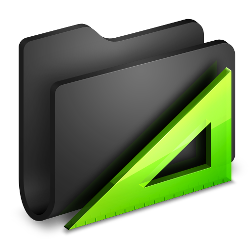
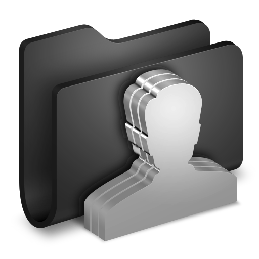

Classifiers are the essence of our tool. They define how the signal processing pipeline looks like and can be e.g. used to translate raw biosensor data into meaningful values. After starting the application, no classifier is loaded. In order to load a classifier from the neuromore Cloud, simply click on the desired classifier item  in the back-end file system window.

#Loading examples

#Edit Classifiers

This article shows how to create new folders, new classifiers and edit existing ones. Right clicking on a given item enables a context menu presenting several options like to save, remove or rename. Different items might have different permissions (read-only, write) and thus show different context menu options.

The following folder types are available:

Folder (read/write) 
Folder (read only) 
Private user / company folder (read/write) 

The neuromore Cloud has a built-in revision system and allows collaborative classifier creation. Previous versions of a classifier can accessed by the context menu. In order to insert new or remove given nodes or connections, open the tool's interface by clicking  on the top right of the graph window.