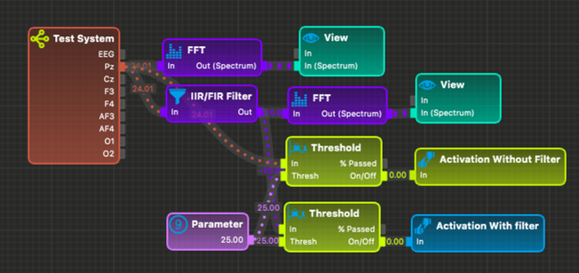

_Note:_ Under Construction

#Introduction

Classifiers are the essence of our tool. They define how the signal processing pipeline looks and can be used to translate raw biosensor data into meaningful values. After starting the application, no classifier is loaded. In order to load a classifier from the neuromore Cloud, simply click on the desired classifier item in the back-end file system window.

#Loading examples

Under construction

#File system

This article shows how to create new folders, new classifiers and edit existing ones. Right clicking on a given item enables a context menu presenting several options like to save, remove or rename. Different items might have different permissions (read-only, write) and thus show different context menu options.

The following folder types are available:

Folder (read/write)
Folder (read only)
Private user / company folder (read/write)

The neuromore Cloud has a built-in revision system and allows collaborative classifier creation. Previous versions of a classifier can be accessed through the context menu. In order to insert new or remove given nodes or connections, open the tool's interface by clicking on the top right of the graph window.

#Vocabulary
Some definitions that might come in handy for the remainder fo ths document and forum discussions about neuromore.

#####Classifier
We call classifiers the complete system from data acquisition to outputs. The name classifier comes from the machine learning lingo where classifiers are algorithms that take in data and assign that data a most probable label or class. While neuromore can be used to create many systems that are not classifiers, conceptually, they are one of the most useful systems that neuromore aims to create.

#####Graphs
neuromore uses [visual programing](https://en.wikipedia.org/wiki/Visual_programming_language) to facilitate the creation of classifiers. In particular, neuromore uses connected graphs that allow user to 'code' data processing routines more intuitively.

#####Nodes
Graphs are made up of interconnected nodes. These nodes act like engineering 'black boxes' that allows user to create functioning graphs just by knowing what individual nodes do without need to understand how they do it. A comprehensive list of all nodes with their inputs, outputs and function can be found in the Nodes section of the documentation.

##Basic Classifier Structure

This example shows a minimal classifier that shows the main structural components of a graph:

**Input:** Signal Generator producing a sine wave with default parameters. (Frequency = 1 Hz, Amplitude = 1)

Parameter, the multiplying factor for my amplifier system. For example, the integer 3.

**Processing:** The processing logic. In this case, computing both an amplified (3x) version of the input and the RMS value of the signal.

**Output:** The Feedback output nodes take in a signal and display it in the feedback window (normally bottom left).

In particular, this feedback is displaying both the raw input signal and the amplified signal together with the constant RMS value.

##Basic EEG Classifier

Now that we know the basics of a classifier, we are ready to see an EEG classifier.

This example is of a basic frequency threshold classifier. The input is the Test System node that gives us a pre recorded signal that while is not an EEG, has similar signal properties.

From this input node we are interested in the Pz electrode (see [10-20 system](https://www.trans-cranial.com/local/manuals/10_20_pos_man_v1_0_pdf.pdf)).

We can see that this node is connected directly to three other nodes. The first is an FFT node that computes the [fast fourier transform](http://mathworld.wolfram.com/FastFourierTransform.html) on the signal which essentially maps the signal to the frequency domain. If we connect the output of this node to a Spectrum input of the View node we can then see the power of the individual frequencies present in the raw signal.

The second copy of the EEG data stream goes to an IIR/FIR Filter node. In particular this node is set to act as a [low pass filter](https://en.wikipedia.org/wiki/Low-pass_filter) with a cut off frequency of 5 Hz.

As we can see in the figure below, when we then input this filtered data stream into an FFT + Spectrum View sub-graph the resulting signal contains much lower powers for frequency bands beyond 5 Hz.

<!--TODO: Exlain Threshold-->
