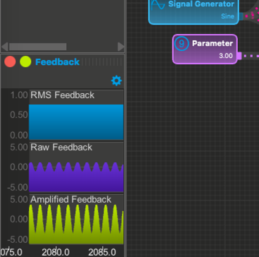
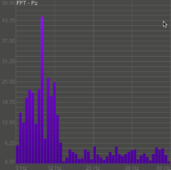
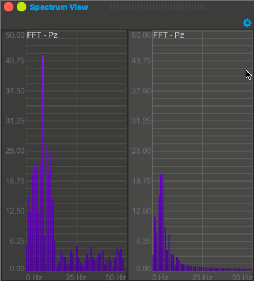

*Note:* Still Under Construction

#Introduction

Classifiers are the essence of our tool. They define how the signal processing pipeline looks like and can be e.g. used to translate raw biosensor data into meaningful values. After starting the application, no classifier is loaded. In order to load a classifier from the neuromore Cloud, simply click on the desired classifier item  in the back-end file system window.

#Loading examples

Under construction

#File system

This article shows how to create new folders, new classifiers and edit existing ones. Right clicking on a given item enables a context menu presenting several options like to save, remove or rename. Different items might have different permissions (read-only, write) and thus show different context menu options.

The following folder types are available:

Folder (read/write)
Folder (read only)
Private user / company folder (read/write)

The neuromore Cloud has a built-in revision system and allows collaborative classifier creation. Previous versions of a classifier can accessed by the context menu. In order to insert new or remove given nodes or connections, open the tool's interface by clicking  on the top right of the graph window.

##Basic Classifier Structure

Minimal classifier example that shows the main structural components of a graph and explains basic signal processing concepts and terms:

**Input:** Signal Generator producing a sine wave with default parameters. (Frequency = 1 Hz, Amplitude = 1)

Parameter, the multiplying factor for my amplifier system. In particular, the integer 3.

**Processing:** The processing logic. In this case, computing both an amplified (3x) version of the input and the RMS value of the signal.

**Output:** The Feedback output nodes take in a signal and display it in the feedback window (normally bottom left).

In particular, this feedback is displaying both the raw input signal and the amplified signal together with the constant RMS value.

##Basic EEG Classifier

Now that we know the basics a classifier, we are ready to see an EEG classifier.

This example is of a basic frequency threshold classifier. The input is the Test System node that gives us a pre recorded signal that while is not EEG, has similar signal properties. 

From this input node we are interested in the Pz electrode (see [10-20 system](https://www.trans-cranial.com/local/manuals/10_20_pos_man_v1_0_pdf.pdf)). 

We can see that this node is connected directly to three other nodes. 

######View Signal Spectrum

The first is an FFT node that computes the [Fast Fourier Transform](http://mathworld.wolfram.com/FastFourierTransform.html) on the signal which essentially maps the signal to the frequency domain. If we connect the output of this node to a Spectrum input of the View node we can then see the power of the individual frequencies present in the raw signal.

######Frequency Filters

The second copy of the EEG data stream goes to an IIR/FIR Filter node. In particular this node is set to act as a [low pass filter](https://en.wikipedia.org/wiki/Low-pass_filter) with a cut off frequency of 5 Hz.

As we can see in the figure below, when we then input this filtered data stream into an FFT + Spectrum View sub-graph the resulting signal contains much lower powers for frequency bands beyond 5 Hz. 

*Note:* As expected with a non-ideal filter, signals with frequencies close to 5Hz are also affected by the filter, resulting in the decrease in amplitude observed in signals with frequencies below 5 Hz. 

######Thresholding

The third copy of the data-stream is passed to a Threshold node. This node compares the average value of the signal over the given time interval (internal parameter) to the given 'Threshold' parameter. The 'ON/OFF' output then returns 1 if the average was higher and 0 otherwise. 

As expected, a plot of the raw signal shows that it passes the threshold much more than one of the filtered signal when using the same threshold. 

<!--Insert graph-->

######Overall picture

As a graph, this example merely aims to report when the 0-5 Hz signal from the Pz electrode exceeds a given threshold. 

As a system, however, this classifier exhibits the main elements of most EEG classifiers. In this design, we see concepts like cleaning your data (filtering), simplifying your data (threshold) and displaying your data (spectrum view) that are essential elements to any classifier.

<!--IN PROGRESS

#Alpha detector

One of the simplest, but also most effective classifiers for EEG data is an alpha frequency detector. 

-->